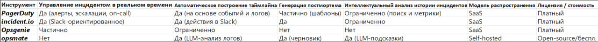

Анализ существующих инструментов управления инцидентами

В рамках данного этапа проводится анализ существующих инструментов, используемых в индустрии для работы с инцидентами (сбоями), их документирования и последующего анализа.
Цель анализа — выявить общую функциональность подобных систем, сравнить существующие подходы и определить области, которые покрыты существующими решениями ограниченно либо не покрыты вовсе.

Результаты анализа в дальнейшем используются для формулирования требований к разрабатываемой системе.

1. Похожие инструменты
1.1 Коммерческие платформы управления инцидентами
1.1.1 PagerDuty

Ссылка: https://www.pagerduty.com/

PagerDuty — коммерческая платформа управления инцидентами, ориентированная на оперативное оповещение дежурных инженеров, эскалацию инцидентов и координацию реагирования.
Основной фокус системы — обеспечение своевременной реакции на сбои за счёт интеграций с мониторингом и строгих процессов эскалации.
Поддержка пост-инцидентного анализа присутствует, однако в значительной степени основана на шаблонах и ручном заполнении отчётов.

1.1.2 incident.io

Ссылка: https://incident.io/

incident.io — платформа управления инцидентами, ориентированная на работу через корпоративные мессенджеры (прежде всего Slack).
Система предоставляет инструменты для ведения инцидентов, сбора таймлайна событий, координации участников и оформления постмортемов.
Отдельное внимание уделяется процессуальному сопровождению инцидента и интеграции с задачами и планированием работ.

1.1.3 Rootly

Ссылка: https://rootly.com/

Rootly — инструмент управления инцидентами с акцентом на автоматизацию процессов реагирования и координацию команд в чате.
Поддерживает шаблоны инцидентов, чек-листы, автоматическое создание задач и постмортемов.
Основной сценарий использования связан с оперативным управлением процессом, а не с глубоким анализом накопленных данных.

1.1.4 FireHydrant

Ссылка: https://firehydrant.com/

FireHydrant — платформа управления инцидентами, ориентированная на фиксацию событий во время инцидента и последующий анализ.
Система предоставляет развитые инструменты для пост-инцидентного разбора, хранения таймлайнов и action items, а также аналитики по инцидентам.

1.1.5 Atlassian Jira Service Management / Opsgenie

Ссылка: https://www.atlassian.com/software/jira/service-management

Решение для ITSM и управления инцидентами в экосистеме Atlassian.
Инциденты рассматриваются как формализованные сущности, тесно связанные с заявками, задачами и внутренними процессами организации.
Система ориентирована на крупные организации и требует предварительного описания процессов и ролей.

1.2 Бесплатные инструменты
1.2.1 Grafana OnCall

Ссылка: https://grafana.com/products/oncall/

Grafana OnCall — инструмент управления дежурствами и инцидентами, интегрированный в экосистему Grafana.
Предоставляет базовые возможности оповещения, эскалации и фиксации инцидентов.
Расширенная аналитика и глубокий анализ инцидентов реализованы ограниченно.

1.3 Open-source решения
1.3.1 Mattermost Playbooks

Ссылка: https://mattermost.com/playbooks/

Mattermost Playbooks — open-source инструмент, являющийся частью платформы Mattermost и предназначенный для управления повторяемыми процессами, в том числе сценариями реагирования на инциденты. Основной задачей Mattermost Playbooks является формализация и стандартизация действий команд при выполнении типовых процессов.

Инструмент ориентирован на использование в чат-ориентированной среде и предполагает, что координация действий участников осуществляется непосредственно в корпоративном мессенджере Mattermost.

Функциональные возможности

Mattermost Playbooks предоставляет следующие ключевые возможности:

создание шаблонов процессов (playbooks), включающих заранее определённые шаги и действия;

использование чек-листов для поэтапного выполнения задач в рамках инцидента;

автоматическое выполнение отдельных действий при запуске процесса (отправка сообщений, уведомлений, запуск интеграций);

назначение ответственных лиц и контроль статуса выполнения задач;

фиксация информации о ходе выполнения процесса (время запуска, длительность, участники);

формирование отчётов и ретроспектив по завершённым процессам.

Таким образом, Mattermost Playbooks выступает в роли процессного и организационного инструмента, направленного на повышение воспроизводимости и управляемости действий команды во время инцидентов.

Ограничения и особенности

Несмотря на широкие возможности по управлению процессами, Mattermost Playbooks имеет ряд ограничений:

инструмент не выполняет автоматический анализ инцидентов на основе логов, метрик или событий;

отсутствует интеллектуальная обработка накопленных данных и анализ причин инцидентов;

генерация постмортемов и аналитических отчётов не автоматизирована и требует ручного участия;

глубокий анализ исторических инцидентов возможен только при использовании внешних аналитических инструментов;

часть расширенной функциональности доступна только в коммерческих редакциях Mattermost.

В результате Mattermost Playbooks можно рассматривать как средство формализации процессов реагирования, но не как инструмент интеллектуального анализа инцидентов.

1.3.2 opsmate-ai / opsmate

Ссылка: https://github.com/opsmate-ai/opsmate

Opsmate — open-source AI-ассистент, предназначенный для поддержки инженеров в анализе технических данных, конфигураций и эксплуатационных проблем. В отличие от классических систем управления инцидентами, Opsmate не ориентирован на координацию процессов или управление дежурствами.

Основная цель инструмента — использование больших языковых моделей (LLM) для помощи инженерам в диагностике и принятии решений при работе с инфраструктурой и программными системами.

Функциональные возможности

Opsmate предоставляет следующие возможности:

взаимодействие с пользователем через интерфейс на естественном языке;

использование LLM для рассуждений, анализа гипотез и формирования рекомендаций;

поддержка различных провайдеров LLM (включая внешние API);

возможность интеграции с инфраструктурными и облачными окружениями;

работа через веб-интерфейс и программный API;

подключение дополнительных источников знаний (документация, инструкции, runbooks).

Архитектурно Opsmate использует LLM как центральный компонент логики, позволяющий интерпретировать текстовые запросы и формировать аналитические ответы.

Ограничения и особенности

Opsmate обладает рядом принципиальных ограничений с точки зрения управления инцидентами:

инструмент не предоставляет механизмов детектирования инцидентов;

отсутствует представление инцидента как формальной сущности;

не поддерживается построение временной линии событий;

отсутствуют средства координации команд и управления процессами реагирования;

генерация формализованных постмортемов не является встроенной функцией.

Таким образом, Opsmate следует рассматривать не как систему управления инцидентами, а как интеллектуального помощника, способного дополнять инженерную деятельность за счёт использования LLM.

2. Общая функциональность существующих решений

Анализ рассмотренных инструментов показывает, что большинство из них в той или иной форме реализуют следующие функции:

представление инцидента как отдельной сущности;

сбор и фиксацию событий, происходящих во время инцидента;

построение временной линии (таймлайна);

координацию действий участников;

оформление пост-инцидентного отчёта (постмортема);

фиксацию последующих действий (action items).

3. Сравнение и различия между решениями

4. Ограничения и проблемные зоны

Анализ показывает, что у большинства решений присутствуют следующие ограничения (в разной степени):

высокая сложность внедрения в крупных организациях
(PagerDuty, Atlassian Jira Service Management / Opsgenie, FireHydrant — требуют предварительной настройки процессов, ролей, интеграций и обучения персонала)

зависимость от конкретных экосистем
(Atlassian Jira Service Management / Opsgenie — тесно интегрирован с экосистемой Atlassian;
incident.io и Rootly — ориентированы прежде всего на Slack как основной канал взаимодействия)

ограниченная интеллектуальная обработка накопленных данных
(PagerDuty, Grafana OnCall — основной фокус сделан на оповещение и процесс реагирования, анализ исторических инцидентов и выявление закономерностей реализованы ограниченно)

разрыв между процессом реагирования и анализом исторических инцидентов
(incident.io, Rootly — активная фаза инцидента хорошо поддержана, однако глубокий анализ накопленного опыта часто выносится в отдельные инструменты или требует ручной работы)

высокая стоимость расширенной аналитической функциональности
(PagerDuty, FireHydrant, Atlassian Jira Service Management — расширенные аналитические возможности и отчётность доступны преимущественно в старших тарифных планах)

5. Выводы по результатам конкурентного анализа

Проведённый анализ показывает, что существующие решения хорошо покрывают процесс реагирования на инциденты, однако:

интеллектуальный анализ накопленного опыта реализован ограниченно;

таймлайн инцидента редко используется как основной источник знаний;

повторное использование знаний из предыдущих инцидентов требует ручных действий или внешних инструментов.

6. Предположения о реализации разрабатываемой системы.

На основании выявленных ограничений формулируются следующие предположения о реализации разрабатываемой системы:

поддержка автоматизированного анализа таймлайнов инцидентов;

использование накопленных постмортемов и исторических данных;

возможность генерации аналитических выводов и подсказок;

минимальная привязка к конкретным платформам и экосистемам;

ориентация на использование LLM в качестве вспомогательного аналитического инструмента.